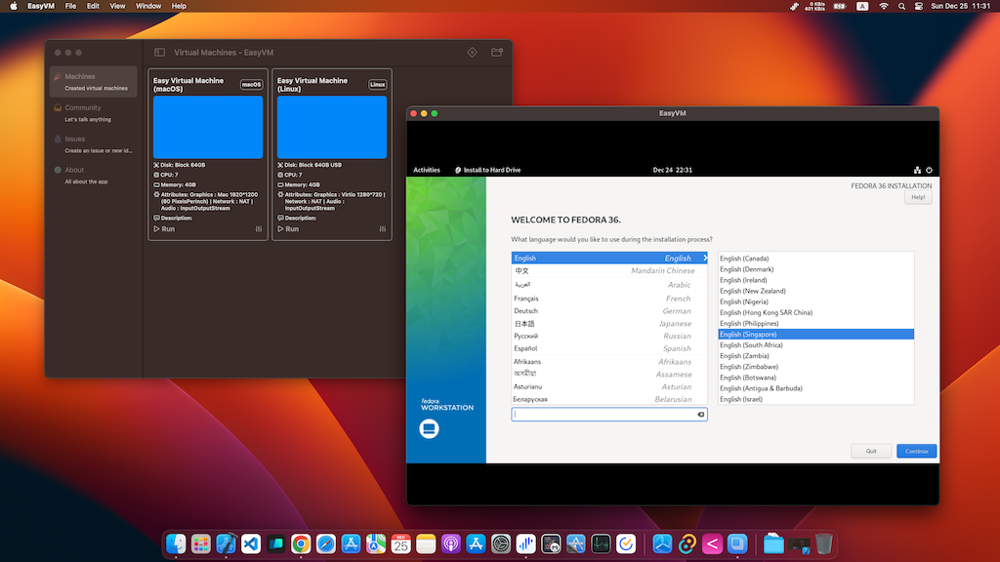
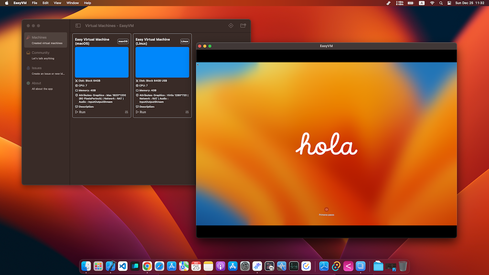

# EasyVM

Yet another virtual machine application based on the Virtualization framework.

https://developer.apple.com/documentation/virtualization

**The project is basically working, but still needs a lot of optimization**

[Discord](https://discord.gg/uxuy3vVtWs)

# Works on

- macOS 13 with Apple chip

# Support

- macOS virutal machine
- Linux virutal machine

# Screenshot

# How to build

- On apple chip macOS 13
- Open EasyVM/EasyVM.xcodeproj
- Run

# Test system images

- macOS
    - Use the download latest option
    - Or find the ipsw file somewhere, e.g. https://ipsw.me/product/Mac
- Linux
    - Fedora https://getfedora.org/en/workstation/download/ remember use ARM images: Fedora 37: aarch64 Live ISO
    - Ubuntu https://cdimage.ubuntu.com/focal/daily-live/current/ remember use ARM images: 64-bit ARM (ARMv8/AArch64) desktop image