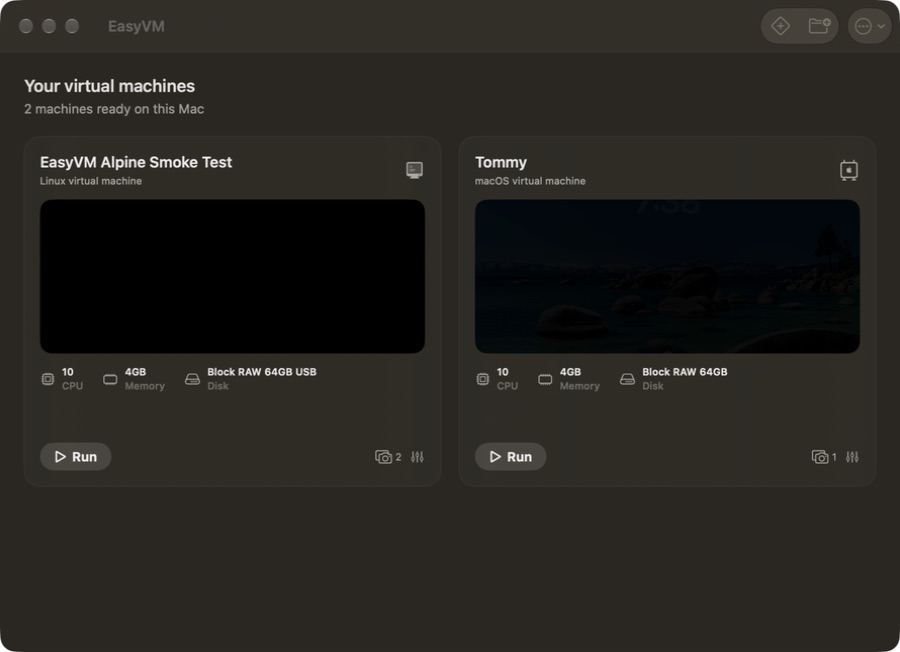

# EasyVM

**A simple, native virtual machine app for Apple silicon Macs.**

[](https://support.apple.com/macos)
[](https://support.apple.com/en-us/116943)
[](LICENSE)
[](https://everettjf.github.io/easyvm/)

EasyVM uses Apple's [`Virtualization.framework`](https://developer.apple.com/documentation/virtualization) to create and run macOS and Linux virtual machines with a focused SwiftUI interface. It aims to be dependable, understandable, and useful without becoming a full emulation suite.

> **Project status:** EasyVM is being refreshed after its original 2022 release. The current code works, but releases should be treated as experimental until the reliability milestone is complete. Keep backups of important VM data.



## What it does

- Creates and runs macOS virtual machines from a local IPSW or Apple's latest supported restore image
- Creates and runs ARM64 Linux virtual machines from an ISO
- Configures CPU, memory, display, storage, networking, audio, pointing devices, and shared directories
- Uses Apple's native virtualization stack—no bundled hypervisor or cross-architecture emulation
- Keeps the app and its VM configuration format intentionally small

## Requirements

- An Apple silicon Mac
- macOS 13 Ventura or later
- Xcode 14 or later to build the current project
- An ARM64 guest image; EasyVM does not emulate x86 guests

## Build from source

1. Clone this repository.
2. Open `EasyVM/EasyVM.xcodeproj` in Xcode.
3. Select the **EasyVM** scheme and your Mac as the run destination.
4. Choose your own development team and bundle identifier if code signing requires it.
5. Build and run with <kbd>⌘R</kbd>.

There is no supported packaged download yet. Reproducible signed releases and a Homebrew Cask are part of the refresh roadmap. Once the release pipeline is ready, installation will be:

```sh
brew install everettjf/tap/easyvm
```

## Guest images

### macOS

Use **Download Latest** in the creation flow, or select a compatible `.ipsw` restore image. Apple publishes current restore images through `Virtualization.framework`; third-party indexes such as [ipsw.me](https://ipsw.me/product/Mac) can help locate older versions.

### Linux

Choose an **ARM64 / AArch64** installer ISO, for example [Ubuntu](https://ubuntu.com/download/server/arm) or [Fedora](https://fedoraproject.org/server/download). Intel/AMD (`x86_64`) images are not supported.

## Direction

EasyVM is not trying to replace UTM, VirtualBuddy, Tart, or Lima. Its direction is narrower:

1. Make VM creation, launch, stop, recovery, and error handling reliable.
2. Add tests, CI, signed releases, Homebrew distribution, diagnostics, and configuration migration.
3. Expose a small, local automation surface so scripts and AI agents can create, start, inspect, and discard isolated VMs safely.

The automation layer will remain local-first, explicit, and opt-in. EasyVM will not embed an AI model or require a cloud account. See the [refresh roadmap](docs/ROADMAP.md), [ecosystem research](docs/RESEARCH.md), and [Homebrew distribution plan](docs/HOMEBREW.md).

## Contributing

Issues and focused pull requests are welcome. During the refresh, reliability fixes, reproducible bug reports, tests, accessibility improvements, and documentation updates have priority over broad new features.

When reporting a VM problem, include the host macOS version, Mac model/chip, guest OS and image source, and the last operation performed. Do not attach VM disks or logs containing secrets.

## Community

- [GitHub Issues](https://github.com/everettjf/easyvm/issues) for bugs and focused feature requests
- [GitHub Discussions](https://github.com/everettjf/easyvm/discussions) for questions and design ideas
- [Discord](https://discord.gg/uxuy3vVtWs) for informal conversation

## License

EasyVM is available under the [MIT License](LICENSE).
